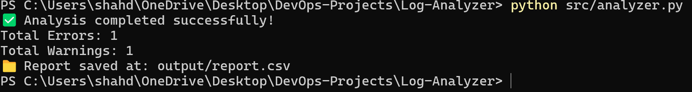

# 🧠 Log Analyzer using Python

## 📌 Overview
This project analyzes log files from systems or applications to extract useful information such as errors, warnings, and usage statistics.  
It was developed as part of my DevOps learning path on Coursera (Month 1: Linux + Git + Python).

---

## 🧰 Tech Stack
- **Language:** Python 3
- **Tools:** Linux Terminal, Git, VS Code
- **Libraries:** os, re, csv, argparse

---

## 📁 Project Structure
Log-Analyzer/
│
├── src/
│   └── analyzer.py
├── data/
│   └── sample_log.txt
├── output/
│   └── report.csv
├── docs/
│   └── result.png        
└── README.md

---

## ⚙️ How to Run

### 1. Clone the repository:
```bash
git clone https://github.com/ShahdAbdAlmonem/log-analyzer-python.git
cd log-analyzer-python
```

### 2. Run the script:
```bash
python3 src/analyzer.py --file data/sample_log.txt --output output/report.csv
```

---

## 🧩 Features
- Reads large log files line by line.
- Extracts:
  - Total requests.
  - Errors and warnings count.
  - Most active users or IPs.
- Generates a **CSV report**.
- Can be customized for any log pattern.

---

## 🧪 Example Output
| IP Address | Requests | Errors | Warnings |
|-------------|-----------|---------|-----------|
| 192.168.1.1 | 134 | 2 | 4 |
| 10.0.0.3 | 67 | 1 | 0 |

---

## 🌱 Learning Goals
- Practice Python scripting and file handling.
- Use Git and GitHub for version control.
- Automate analysis of server logs using Linux CLI.

---

## 📸 Example Screenshot


---

## 👩🏻‍💻 Author
**Shahd Abd Almonem**  
Part of the DevOps 6-Month Learning Path

---

## 📜 License
MIT License © 2025 Shahd Abd Almonem
